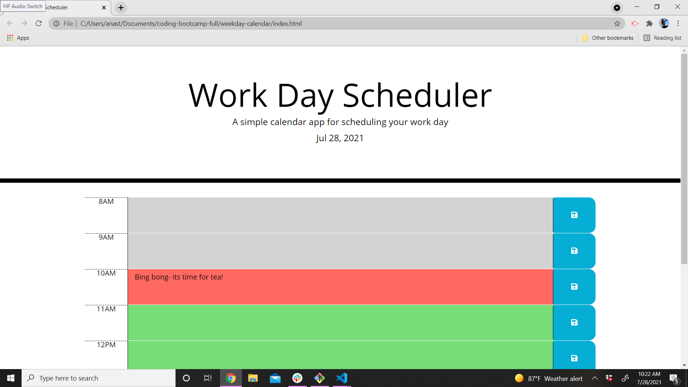

# weekday-calendar

## Languages Used 
HTML, CSS and Javascript(JQuery)

## Purpose and Requirements 
The purpose of this project was to match time with javascript and css. The requirements were that depending on the time, the red would be present time, grey past time and green being future time. Another functionality is to save items through local storage and be displayed even when refreshed. 

## Improvements 
I'm pretty proud of this one since it's fairly condensed but I could always look for improvements in pushing the local storage to the dom. 

## Screenshot of weekday-calendar 

## Link to Deplyed website 
https://akerschen-coder.github.io/weekday-calendar/ 